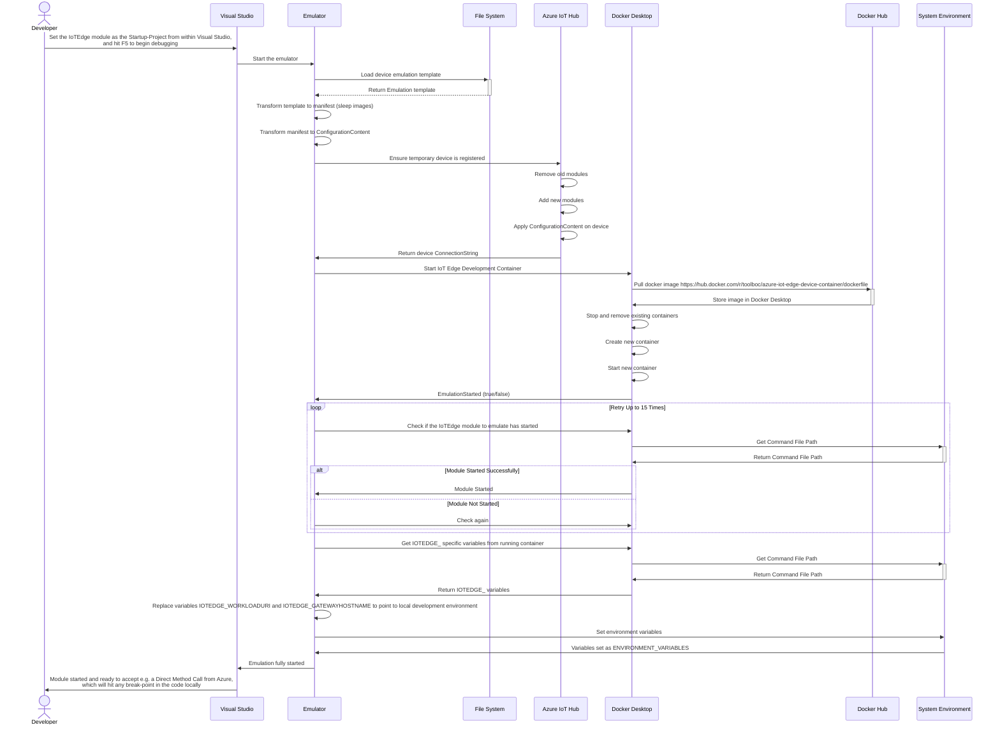
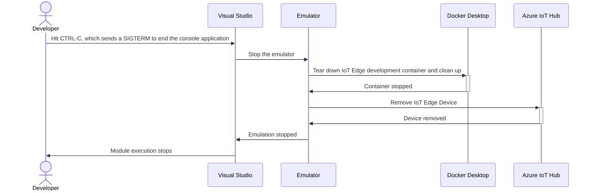

# Introduction

IoT library, which contains common services for Azure IotHub, DeviceProvisioningService (DPS), Iot edge devices, modules, and device twins, including an Iot edge module emulator and examples for setting up Microsoft OPC publisher module and related projects.

# Table of Content

- [Introduction](#introduction)
- [Table of Content](#table-of-content)
- [Atc.Azure.IoT](#atcazureiot)
  - [IIoTHubService](#iiothubservice)
    - [Features](#features)
    - [Methods](#methods)
      - [Device Management](#device-management)
      - [Device Twin Management](#device-twin-management)
      - [Module Management](#module-management)
    - [Usage Example](#usage-example)
    - [Configuring IIoTHubService](#configuring-iiothubservice)
      - [Example Usage](#example-usage)
  - [IoTHubModuleService](#iothubmoduleservice)
    - [Features](#features-1)
    - [Method](#method)
      - [Direct Method Invocation](#direct-method-invocation)
    - [Usage Example](#usage-example-1)
  - [IDeviceProvisioningService](#ideviceprovisioningservice)
    - [Features](#features-2)
    - [Methods](#methods-1)
      - [Individual Enrollment Management](#individual-enrollment-management)
    - [Usage Example](#usage-example-2)
    - [Configuring IDeviceProvisioningService](#configuring-ideviceprovisioningservice)
      - [Example Usage](#example-usage-1)
  - [IDeviceTwinModuleExtractor](#idevicetwinmoduleextractor)
    - [Features](#features-3)
    - [Method](#method-1)
      - [Module Retrieval](#module-retrieval)
    - [Usage Example](#usage-example-3)
- [CLI](#cli)
  - [Installation](#installation)
  - [Update](#update)
  - [Usage](#usage)
    - [Option --help](#option---help)
- [Atc.Azure.IoTEdge](#atcazureiotedge)
  - [Features](#features-4)
    - [Extensions](#extensions)
    - [Factories](#factories)
    - [Wrappers](#wrappers)
    - [Mocks](#mocks)
    - [TestMocks](#testmocks)
  - [Usage Examples](#usage-examples)
    - [Setup for Different Execution Modes](#setup-for-different-execution-modes)
- [Atc.Azure.IoTEdge.DeviceEmulator](#atcazureiotedgedeviceemulator)
  - [Local Debugging](#local-debugging)
  - [Local Development / Testing](#local-development--testing)
- [Sample Project](#sample-project)
  - [Atc.Azure.Iot.Sample.Modules.Contracts](#atcazureiotsamplemodulescontracts)
  - [IoT Edge Modules](#iot-edge-modules)
    - [SimulationModule](#simulationmodule)
    - [OpcPublisherNodeManager](#opcpublishernodemanager)
    - [OpcPublisher](#opcpublisher)
- [Requirements](#requirements)
- [How to contribute](#how-to-contribute)

# Atc.Azure.IoT

[](https://www.nuget.org/packages/atc.azure.iot)

The `Atc.Azure.IoT` package contains various services needed when working with Azure IoTHub, Device Provisioning Service (DPS) and IoT Edge module communication.

## IIoTHubService

The `IIoTHubService` is designed to facilitate communication with Azure IoT Hub, enabling management of devices and modules. This service is integral for applications needing comprehensive control over device registries, twin configurations, and direct method invocations.

### Features

- **Device Management**: Create, retrieve, update, and delete devices in the IoT Hub. It supports both normal and edge-enabled devices.
- **Device Registry Statistics**: Retrieve statistics of the device registry, providing insights into the current state and scale of your IoT infrastructure.
- **Device Twins**: Manage device twins, which represent device properties and states, allowing for detailed configuration and control of each device remotely.
- **Module Management**: For IoT Edge devices, manage individual modules, including creating, updating, and deleting module twins and invoking direct methods on them.
- **Connection Management**: Fetch connection strings for individual devices, facilitating secure communication channels.
- **Configuration and Updates**: Apply configuration changes and updates to devices and modules, ensuring devices operate with the latest settings and firmware.

### Methods

#### Device Management
- `CreateDevice(string deviceId, bool edgeEnabled, CancellationToken cancellationToken)`: Create a new device with the option to enable as an edge device.
- `DeleteDevice(string deviceId, CancellationToken cancellationToken)`: Delete a device from the IoT Hub.
- `GetDevice(string deviceId, CancellationToken cancellationToken)`: Retrieve a specific device using its device ID.
- `GetDeviceConnectionString(string deviceId, CancellationToken cancellationToken)`: Get the connection string for a specific device.
- `ApplyConfigurationContentOnDevice(string deviceId, ConfigurationContent manifestContent, CancellationToken cancellationToken)`: Apply configuration settings to a device.

#### Device Twin Management
- `GetDeviceTwin(string deviceId, CancellationToken cancellationToken)`: Fetch the device twin for a specific device.
- `UpdateDeviceTwin(string deviceId, Twin twin, CancellationToken cancellationToken)`: Update the device twin data.
- `GetDeviceTwins(bool onlyIncludeEdgeDevices)`: Retrieve all device twins, with an option to filter for only edge devices.

#### Module Management
- `GetModuleTwin(string deviceId, string moduleId, CancellationToken cancellationToken)`: Retrieve a specific module twin.
- `UpdateDesiredProperties(string deviceId, string moduleId, TwinCollection twinCollection, CancellationToken cancellationToken)`: Update desired properties on a module twin.
- `RemoveModuleFromDevice(string deviceId, string moduleId, CancellationToken cancellationToken)`: Remove a module from an IoT device.
- `AddNewModules(string deviceId, ConfigurationContent manifestContent, CancellationToken cancellationToken)`: Add new modules to an IoT device.
- `RestartModuleOnDevice(string deviceId, string moduleId, CancellationToken cancellationToken)`: Restart a specific module on a device.

### Usage Example

Below is a sample usage of `IIoTHubService` to create a new device:

```csharp
var iotHubService = serviceProvider.GetRequiredService<IIoTHubService>();
var result = await iotHubService.CreateDevice("myDeviceId", true, CancellationToken.None);
if (result.Succeeded)
{
    Console.WriteLine($"Device created with ID: {result.Device?.Id}");
}
```

### Configuring IIoTHubService

The `ConfigureIotHubServices` extension method from `ServiceCollectionExtensions` helps configure and register IoT Hub related services with your application's `IServiceCollection`. This setup is crucial for utilizing the IIoTHubService and related services effectively.

#### Example Usage

Here's how you can configure your services using this extension method:

```csharp
public void ConfigureServices(IServiceCollection services)
{
    var iotHubOptions = new IotHubOptions
    {
        ConnectionString = "your_iot_hub_connection_string"
    };

    services.ConfigureIotHubServices(iotHubOptions);
}
```

## IoTHubModuleService

The `IIoTHubModuleService` is tailored for direct interactions with IoT devices and modules through Azure IoT Hub. It enables the invocation of direct methods on devices, providing a bridge for cloud-to-device communication. This service is essential for scenarios requiring immediate action or feedback from IoT devices, such as changing operational modes, updating settings, or retrieving immediate status reports.

### Features

- **Direct Method Invocation**: Send commands directly to a specific module on an IoT device and receive responses, which is crucial for real-time device management and operations.

### Method

#### Direct Method Invocation
- `CallMethod(string deviceId, string moduleId, MethodParameterModel parameters, CancellationToken cancellationToken)`: This method sends a direct command to a specified module on a device. The `MethodParameterModel` allows for detailed specification of the command, and the operation returns a `MethodResultModel` that includes the status of the call and any resultant data in JSON format.

### Usage Example

Below is an example demonstrating how to invoke a direct method on an IoT module using `IoTHubModuleService`:

```csharp
var iotHubModuleService = serviceProvider.GetRequiredService<IIoTHubModuleService>();
var parameters = new MethodParameterModel
{
    MethodName = "Restart",
    Payload = "{}" // Additional parameters for the method could be specified here.
};

var result = await iotHubModuleService.CallMethod("device123", "module456", parameters, CancellationToken.None);
if (result.Status == 200)
{
    Console.WriteLine("Method executed successfully. Response: " + result.JsonPayload);
}
else
{
    Console.WriteLine("Method execution failed. Status: " + result.Status);
}
```

## IDeviceProvisioningService

The `IDeviceProvisioningService` is designed to manage device enrollments within Azure's Device Provisioning Service (DPS). It supports operations for TPM and non-TPM devices, streamlining the enrollment and provisioning process. This service is crucial for managing individual device enrollment records and executing enrollment operations, including TPM-based enrollments with specific properties and tags.

### Features

- **Enrollment Management**: Manage the lifecycle of device enrollments in DPS, including creation, retrieval, and deletion.
- **TPM and Non-TPM Support**: Facilitates provisioning for devices with or without TPM (Trusted Platform Module), catering to a wide range of security requirements.
- **Bulk Operations**: Retrieve all individual enrollments, aiding in large-scale management and oversight.

### Methods

#### Individual Enrollment Management
- `GetIndividualEnrollment(string registrationId, CancellationToken cancellationToken)`: Retrieves a specific enrollment using the registration ID.
- `GetIndividualEnrollments(CancellationToken cancellationToken)`: Fetches all registered individual enrollments.
- `CreateIndividualTpmEnrollment(string endorsementKey, string registrationId, string deviceId, Dictionary<string, string>? tags, Dictionary<string, string>? desiredProperties, CancellationToken cancellationToken)`: Creates or updates a TPM enrollment with specified parameters.
- `DeleteIndividualEnrollment(string registrationId, CancellationToken cancellationToken)`: Deletes an individual enrollment based on the registration ID.

### Usage Example

Below is an example demonstrating how to create a TPM-based enrollment using `DeviceProvisioningService`:

```csharp
var deviceProvisioningService = serviceProvider.GetRequiredService<IDeviceProvisioningService>();
var tags = new Dictionary<string, string>
{
    { "location", "datacenter1" }
};
var desiredProperties = new Dictionary<string, string>
{
    { "configVersion", "v1" }
};

var result = await deviceProvisioningService.CreateIndividualTpmEnrollment(
    "TPM_ENDORSEMENT_KEY_HERE",
    "registration123",
    "device123",
    tags,
    desiredProperties,
    CancellationToken.None
);

if (result.Enrollment != null)
{
    Console.WriteLine($"Enrollment created: {result.Enrollment.RegistrationId}");
}
else
{
    Console.WriteLine($"Failed to create enrollment: {result.ErrorMessage}");
}
```

### Configuring IDeviceProvisioningService

The `ConfigureDeviceProvisioningServices` extension method simplifies the integration of Azure DPS related services into your service collection, facilitating easy management of device enrollments.

#### Example Usage

To set up your services, you can add the following code to your `ConfigureServices` method:

```csharp
public void ConfigureServices(IServiceCollection services)
{
    var deviceProvisioningServiceOptions = new DeviceProvisioningServiceOptions
    {
        ConnectionString = "your_device_provisioning_service_connection_string"
    };

    services.ConfigureDeviceProvisioningServices(deviceProvisioningServiceOptions);
}
```

## IDeviceTwinModuleExtractor

The `IDeviceTwinModuleExtractor` is designed to aid in extracting module information from the Edge Agent Twin in Azure IoT solutions. This interface provides targeted functionality for retrieving specific modules from the complex structure of an Edge Agent twin, simplifying the access to module-specific details crucial for operations and monitoring.

### Features

- **Module Extraction**: Extract and retrieve detailed information about a specific module from the Edge Agent twin, enhancing module management and oversight.

### Method

#### Module Retrieval
- `GetModuleFromEdgeAgentTwin(Twin twin, string moduleId)`: Extracts a module from the Edge Agent twin using the module identifier. This method is essential for operations needing detailed information about individual modules managed by the Edge Agent.

### Usage Example

Below is an example demonstrating how to use the `DeviceTwinModuleExtractor` to extract a module's information from an Edge Agent twin:

```csharp
var deviceTwinModuleExtractor = serviceProvider.GetRequiredService<IDeviceTwinModuleExtractor>();
var edgeAgentTwin = // Assume this is fetched or provided somewhere in your application.

var moduleId = "module123";
var module = await deviceTwinModuleExtractor.GetModuleFromEdgeAgentTwin(edgeAgentTwin, moduleId);

if (module != null)
{
    Console.WriteLine($"Module Found: {module.Name}");
}
else
{
    Console.WriteLine("Module not found.");
}
```

# CLI

[](https://www.nuget.org/packages/atc-azure-iot)

The `Atc.Azure.IoT.CLI` tool is available through a cross platform command line application.

## Installation

The tool can be installed as a .NET global tool by the following command

```powershell
dotnet tool install --global atc-azure-iot
```

or by following the instructions [here](https://www.nuget.org/packages/atc-azure-iot/) to install a specific version of the tool.

A successful installation will output something like

```powershell
The tool can be invoked by the following command: atc-azure-iot
Tool 'atc-azure-iot' (version '1.0.xxx') was successfully installed.`
```

## Update

The tool can be updated by the following command

```powershell
dotnet tool update --global atc-azure-iot
```

## Usage

Since the tool is published as a .NET Tool, it can be launched from anywhere using any shell or command-line interface by calling **atc-azure-iot**. The help information is displayed when providing the `--help` argument to **atc-azure-iot**

### Option <span style="color:yellow">--help</span>

```powershell
atc-azure-iot --help

USAGE:
    atc-azure-iot.exe [OPTIONS] <COMMAND>

EXAMPLES:
    atc-azure-iot.exe iothub statistics -c <connection-string>
    atc-azure-iot.exe iothub device create -c <connection-string> -d <device-id> --edge-enabled
    atc-azure-iot.exe iothub device get -c <connection-string> -d <device-id>
    atc-azure-iot.exe iothub device delete -c <connection-string> -d <device-id>
    atc-azure-iot.exe dps enrollment individual all -c <connection-string>

OPTIONS:
    -h, --help       Prints help information
    -v, --version    Prints version information

COMMANDS:
    dps       Operations related to Device Provisioning Service
    iothub    Operations related to IoT Hub
```

# Atc.Azure.IoTEdge

The `Atc.Azure.IoTEdge` package is specifically designed to enhance Azure IoT Edge module projects, providing critical functionalities for both development and testing environments. This library simplifies the creation, configuration, and testing of IoT Edge modules, enabling developers to efficiently manage device interactions and module behaviors.

## Features

### Extensions
- **HostBuilderContextExtensions**: Determines the execution mode of the IoT Edge module, facilitating different behaviors and configurations based on the deployment environment (Standalone, Emulator, or Regular).

- **ServiceCollectionExtensions**: Assists in integrating IoT Edge module functionalities by registering dependencies like `ModuleClientWrapper` which abstracts and simplifies interactions with Azure IoT Hub.

### Factories
- **IMethodResponseFactory/MethodResponseFactory**: Supports creating method responses for device modules, allowing customization of serialization settings to fit different data handling requirements.

- **TransportSettingsFactory**: Provides AMQP and MQTT transport settings, essential for connecting IoT modules to Azure IoT Hub, especially in simulated or emulated environments.

### Wrappers
- **IModuleClientWrapper/ModuleClientWrapper**: Wraps the Azure IoT `ModuleClient`, providing a managed way to interact with IoT Hub. It handles operations like sending device-to-cloud messages, responding to direct method calls, and updating device twins.

### Mocks
- **IMockModuleClientWrapper/MockModuleClientWrapper**: Offers a mock implementation of `IModuleClientWrapper`, useful for module testing without requiring an actual IoT Hub connection. This enables comprehensive unit and integration testing by simulating various IoT operations.

### TestMocks
- **MockTwinProperties**: Allows testing modules with predefined desired and reported properties, simplifying state management and behavior testing without interacting with a live IoT Hub.

## Usage Examples

### Setup for Different Execution Modes
Here is how you can use `Atc.Azure.IoTEdge` in an IoT Edge module, considering different execution modes such as standalone or emulator:

```csharp
using var host = Host.CreateDefaultBuilder(args)
    .ConfigureServices((hostContext, services) =>
    {
        services.AddLogging(builder =>
        {
            builder.AddSimpleConsole(options => options.TimestampFormat = LoggingConstants.TimestampFormat);
            builder.SetMinimumLevel(LogLevel.Trace);
        });

        if (hostContext.IsStandaloneMode())
        {
            services.AddSingleton<IModuleClientWrapper, MockModuleClientWrapper>();
        }
        else if (hostContext.IsEmulatorMode())
        {
            // Setup for emulator mode
            services.AddModuleClientWrapper(TransportSettingsFactory.BuildAmqpTransportSettings());
            // Additional setup for emulator
        }
        else
        {
            // Regular operational mode
            services.AddModuleClientWrapper(TransportSettingsFactory.BuildMqttTransportSettings());
        }

        services.AddSingleton<IMethodResponseFactory, MethodResponseFactory>();
        services.AddHostedService<MyEdgeModuleService>();

        services.Configure<HostOptions>(options =>
        {
            options.ShutdownTimeout = TimeSpan.FromSeconds(10);
        });
    })
    .UseConsoleLifetime()
    .Build();

await host.RunAsync();
```

# Atc.Azure.IoTEdge.DeviceEmulator

The `Atc.Azure.IoTEdge.DeviceEmulator` package is specifically designed for adding to IoTEdge module projects, when developing and testing IoTEdge modules locally. This package does so, by providing an emulator.

## Local Debugging

An example of setting up the emulator in an iotedge module can be found in the sample module [opcpublishernodemanagermodule](sample/src/IoTEdgeModules/modules/opcpublishernodemanagermodule/Program.cs)

## Local Development / Testing

If e.g. we want to locally debug the `OpcPublisherNodeManagerModule`, the following pre-requisites should be met.

1. Ensure the file [launchsettings.json](/sample/src/IoTEdgeModules/modules/opcpublishernodemanagermodule/Properties/launchSettings.json) is created with the following content

> ```json
> {
>   "profiles": {
>     "OpcPublisherNodeManagerModule": {
>       "commandName": "Project",
>       "environmentVariables": {
>         "DOTNET_ENVIRONMENT": "Emulator" | "Standalone"
>       }
>     },
>     "Docker": {
>       "commandName": "Docker"
>     }
>   }
> }
> ```

The `DOTNET_ENVIRONMENT` variable can be configured with two possible values: `Emulator` or `Standalone`. When set to `Standalone`, the system initializes only the module, verifying its startup and the correct configuration of its dependencies. Conversely, setting `DOTNET_ENVIRONMENT` to `Emulator` launches the emulator, allowing for debugging of the specified module.

2. Ensure a copy of `appsettings.example.json` is created with the name `appsettings.emulator.json` with the following content inside of the module in question
    >```json
    >{
    >  "EmulatorOptions": {
    >    "TemplateFilePath": ".[INSERT_LOCAL_PATH]\\sample\\src\\IoTEdgeModules\\deployment.template.emulation.manifest.json",
    >    "IotHubConnectionString": "[INSERT_IOTHUB_SAS_POLICY_CONNECTION_STRING]"
    >  }
    >}
    >```

Once the previous pre-requisites are in place, the module can be locally debugged/tested, by the following flow:



When debugging concludes, the emulator is then stopped according to this sequence:



# Sample Project

## Atc.Azure.Iot.Sample.Modules.Contracts

This sample library demonstrates how to share contracts between IoT Edge modules and, for example, a WebAPI, which uses the [IoTHubModuleService](/src/Atc.Azure.IoT/Services/IoTHub/IoTHubModuleService.cs) to invoke direct methods. By leveraging a shared common library, it is ensured that all components are properly linked at compile time, maintaining integrity across all references. The modules located in the [sample modules](/sample/src/IoTEdgeModules/modules/) folder all make use of this library, showcasing its practical application in real scenarios.

## IoT Edge Modules

In the [sample modules](/sample/src/IoTEdgeModules/modules/) folder, a few IoT Edge modules are included.

### SimulationModule

The module is not configured to use an emulator. Instead, it relies on Quartz.Net for scheduling tasks. The module features a [`PulsJob`](/sample/src/IoTEdgeModules/modules/simulationmodule/Jobs/PulsJob.cs), which is responsible for emitting temperature telemetry at 5-second intervals. This telemetry simulates temperature readings by following a sinusoidal curve.

### OpcPublisherNodeManager

This module is configured to use the emulator due to its extensive use of Direct Method calls. It is designed to manage the configuration file for the Microsoft OpcPublisher module, providing methods to manipulate it.

Direct Methods supported:

- GetEndpoints
- GetEndpointWithNodes
- GetEndpointsWithEmptyOpcNodesList
- AddEndpoint
- AddNodeToEndpoint
- AddNodesToEndpoint
- UpdateNodeOnEndpoint
- UpdateNodesOnEndpoint
- RemoveNodeFromEndpoint
- RemoveNodesFromEndpoint
- RemoveAllNodesFromEndpoint
- RemoveEndpoint

### OpcPublisher

For guidance on how to configure the OpcPublisher from Microsoft, refer to this [example](/sample/src/IoTEdgeModules/deployment.template.json) located in the sample folder. This file provides a detailed template for setting up your deployment configuration.

The latest release of the OpcPublisher can be accessed [here](https://github.com/Azure/Industrial-IoT/releases).

# Requirements

* [.NET 8 SDK](https://dotnet.microsoft.com/en-us/download/dotnet/8.0)

# How to contribute

[Contribution Guidelines](https://atc-net.github.io/introduction/about-atc#how-to-contribute)

[Coding Guidelines](https://atc-net.github.io/introduction/about-atc#coding-guidelines)
